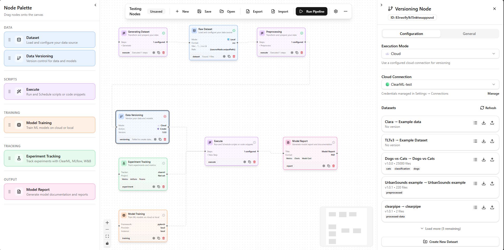

<div align="center">
  
</div>

An interactive visual ML pipeline builder. Create, configure, and manage machine learning pipelines with a drag-and-drop interface.

  

## Features

<div align="center">
  
</div>

- 🎨 **Visual Pipeline Builder** - Drag-and-drop interface to create ML pipelines
- 📦 **Multiple Node Types**:
  - **Dataset** - Load data from local, cloud (S3, GCS, Azure Blob), or URLs
  - **Versioning** - Version control with DVC, Git LFS, ClearML Data, MLflow
  - **Execute** - Data transformation and feature engineering
  - **Training** - Train models on local or cloud (GCP, AWS, Azure)
  - **Experiment Tracking** - Integrate with ClearML, MLflow, W&B, Comet
  - **Report** - Generate model reports in HTML, PDF, Markdown, or JSON
- 🔐 **Credential Management** - Securely configure credentials for each node
- 💾 **Pipeline Persistence** - Save and load pipelines with localStorage
- 📤 **Import/Export** - Export pipelines as JSON for sharing
- 🎛️ **Collapsible & Resizable Panels** - Customize your workspace layout

## Getting Started

### Prerequisites

- Node.js 18+
- pnpm (recommended) or npm

### Installation

```bash
# Clone the repository
git clone https://github.com/NaveDanan/clearpipe.git
cd clearpipe

# Install dependencies
pnpm install

# Start the development server
pnpm dev
```

Open [http://localhost:3000](http://localhost:3000) to see the application.

## Usage

1. **Drag nodes** from the left palette onto the canvas
2. **Connect nodes** by dragging from output handles to input handles
3. **Click a node** to configure its properties in the right panel
4. **Collapse/resize panels** using the arrow buttons and drag handles
5. **Save your pipeline** using the toolbar buttons

## Tech Stack

- **Framework**: Next.js 16 with App Router
- **UI Components**: shadcn/ui with Radix UI primitives
- **Flow Canvas**: React Flow (@xyflow/react)
- **State Management**: Zustand with persist middleware
- **Styling**: Tailwind CSS v4
- **Forms**: React Hook Form + Zod
- **Icons**: Lucide React

## Project Structure

```
src/
├── app/                    # Next.js App Router
├── components/
│   ├── nodes/              # Custom React Flow nodes
│   ├── pipeline/           # Pipeline-specific components
│   └── ui/                 # shadcn/ui components
├── config/                 # Node type definitions
├── lib/                    # Utilities
├── stores/                 # Zustand stores
└── types/                  # TypeScript type definitions
```

## License

MIT License - see [LICENSE](LICENSE) for details.

## Contributing

Contributions are welcome! Please feel free to submit a Pull Request.
